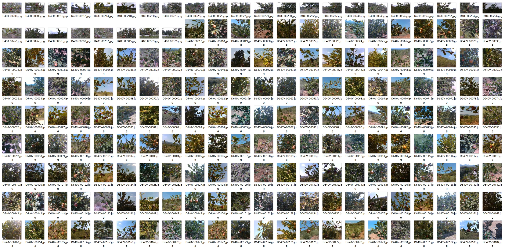
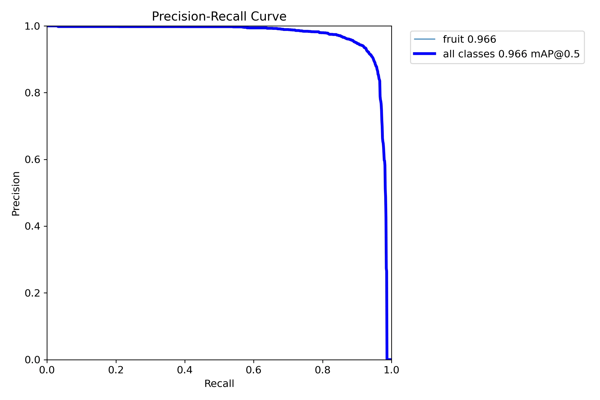
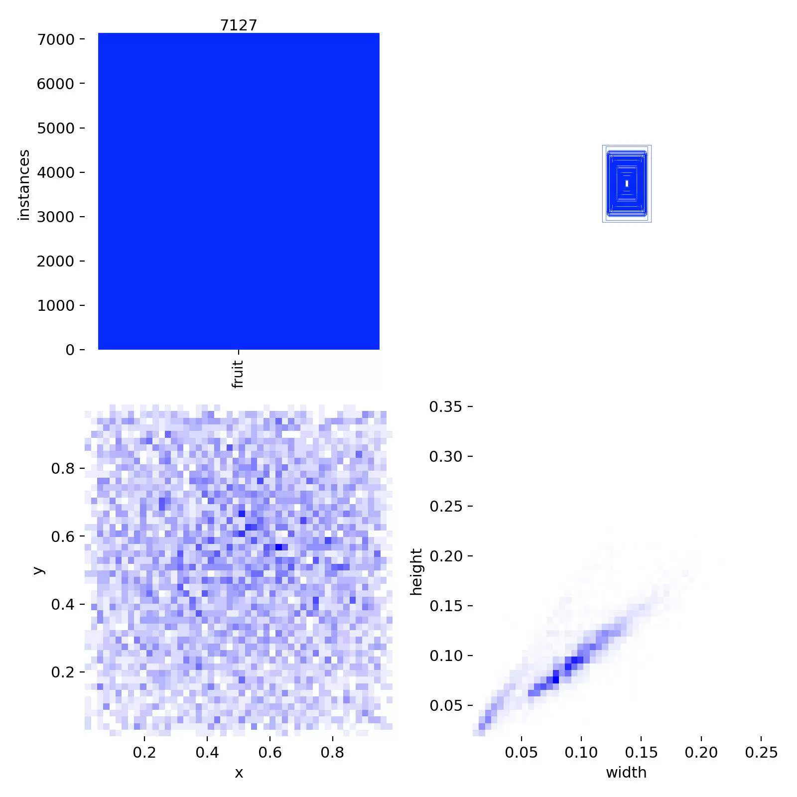
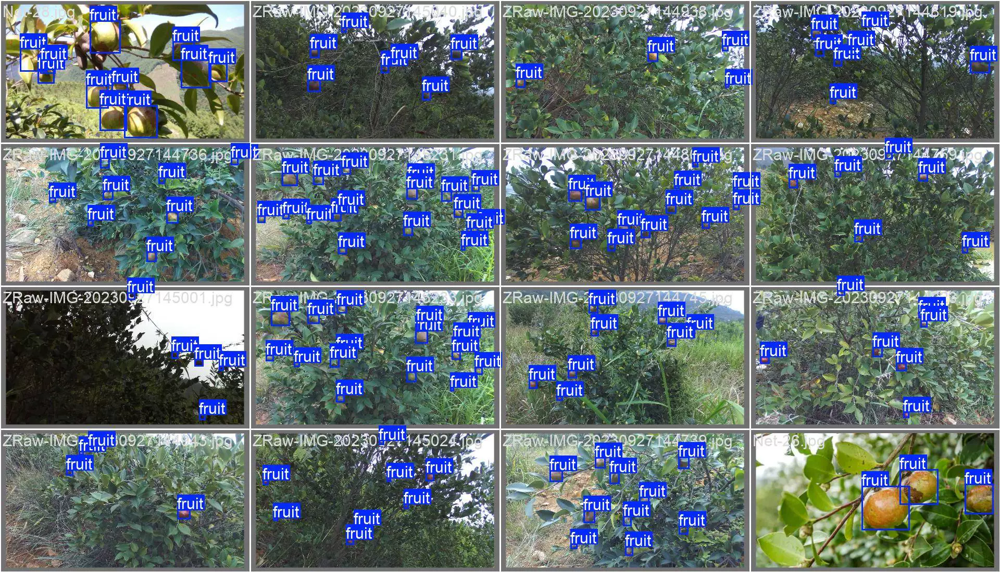
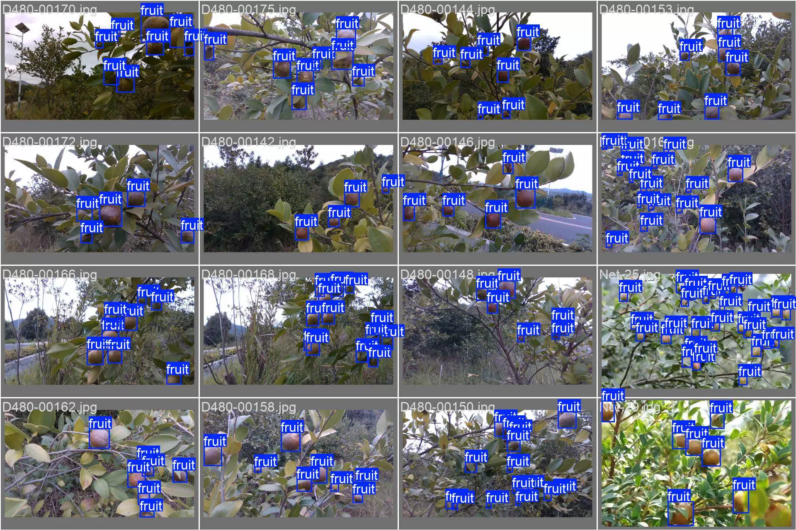
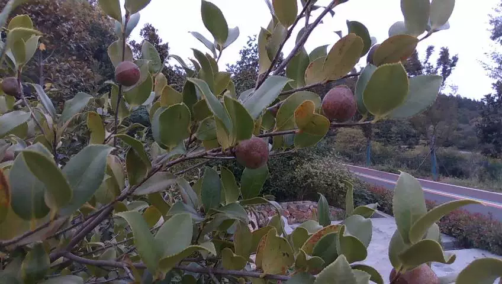
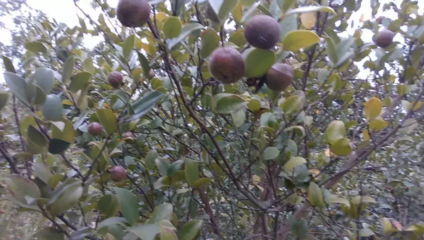

## Body

(Agricultural Product) Camellia Flower Oil Fruit Quantity Detection Dataset in YOLO format

Totally 1677 images, each labeled separately, and the training set, test set, and validation set have been divided.

Training set: 1012 images
Test set: 328 images
Validation set: 337 images

This dataset is divided into 1 class, namely: fruit.

The best.py file and training process file are included. The YOLOv8s basic model is trained for 100 rounds. mAP@0.5 = 0.966. The data source is an article.

Electronic virtual products sold without return or exchange.

## Images

Here is a pay link on Stripe ( https://buy.stripe.com/3cs8yP7sY87d0vu9AB ). Please contact me lonlonago@foxmail.com after funding $89, and I will send you a complete data files , thank you!

